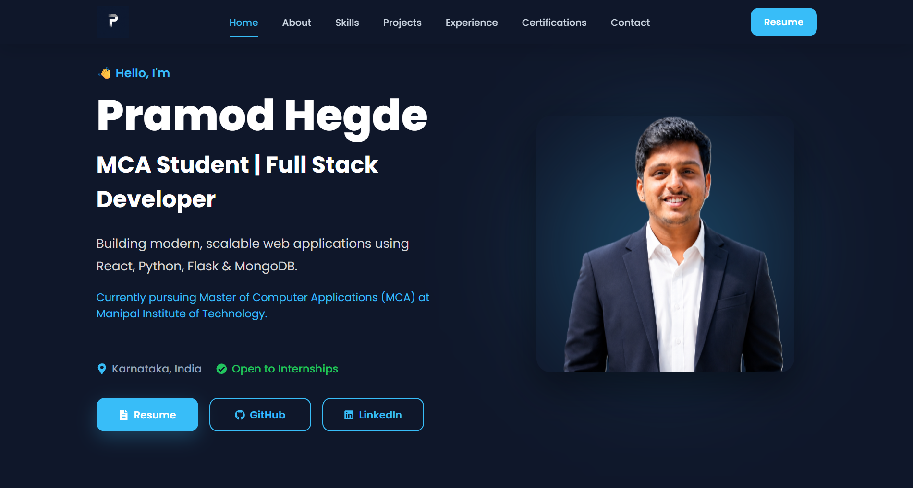
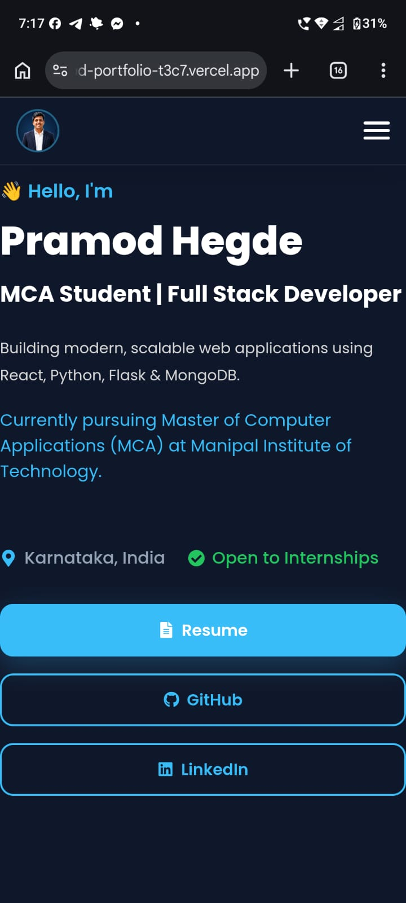

# 👋 Pramod Hegde – Personal Portfolio

A modern, responsive, and interactive developer portfolio built using **React**. It showcases my projects, skills, certifications, experience, and contact information in a clean and professional interface.

🌐 **Live Portfolio:** https://pramod-portfolio-t3c7.vercel.app
---

## ✨ Features

- 🎨 Modern and responsive UI
- 📱 Mobile-first design
- 👤 Interactive profile avatar
- 🚀 Smooth scrolling navigation
- 📂 Featured projects with GitHub & Live Demo
- 🏆 Certificates with image preview
- 💼 Experience timeline
- 🛠️ Skills categorized by technology
- 📄 Resume download
- 📬 Contact section with social links
- ⚡ Fast performance with Vite
- 🌙 Clean dark theme

---

# 📸 Preview

> Add screenshots here after uploading them to GitHub.

### Desktop




### Mobile



---

# 🛠 Tech Stack

### Frontend

- React
- Vite
- JavaScript (ES6+)
- HTML5
- CSS3

### Libraries

- React Icons
- Yet Another React Lightbox

### Deployment

- Vercel

---

# 📂 Folder Structure

```text
src
│
├── assets
│   ├── images
│   └── resume
│
├── components
│   ├── Navbar
│   ├── Hero
│   ├── About
│   ├── Skills
│   ├── Projects
│   ├── Experience
│   ├── Certificates
│   ├── Contact
│   └── Footer
│
├── constants
│   ├── personal.js
│   ├── projects.js
│   ├── skills.js
│   ├── certificates.js
│   ├── experience.js
│   └── navigation.js
│
└── App.jsx
```

---

# 🚀 Getting Started

### Clone the repository

```bash
git clone https://github.com/pramodhegde7/portfolio.git
```

### Navigate to the project

```bash
cd portfolio
```

### Install dependencies

```bash
npm install
```

### Start development server

```bash
npm run dev
```

### Build for production

```bash
npm run build
```

---

# 📌 Sections

- Home
- About
- Skills
- Projects
- Experience
- Certificates
- Contact

---

# 📄 Resume

The latest version of my resume is available directly from the portfolio.

---

# 📬 Connect With Me

**Portfolio**

https://pramod-portfolio-t3c7.vercel.app

**GitHub**

https://github.com/pramodhegde7

**LinkedIn**

https://linkedin.com/in/pramodhegde7

**Email**

pramodhegde2004@gmail.com

---

# ⭐ Future Improvements

- Project detail pages
- Blog section
- Dark/Light theme toggle
- More featured projects
- Performance optimizations

---

# 📜 License

This project is licensed under the MIT License.

Feel free to fork this repository for learning purposes, but please do not copy the design or content directly.

---

## 🙏 Thank You

Thank you for visiting my portfolio!

If you like this project, consider giving it a ⭐ on GitHub.
